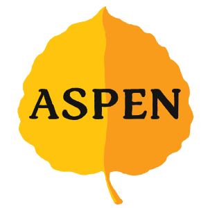

  

<h1 align="center">
  Aspen Chess Engine  
  
  
  
</h1>

Aspen is a UCI chess engine written in C++ that evaluates positions using a custom NNUE.

You can play against it online on [lichess](https://lichess.org/@/AspenBot).

## Download

You can find the latest stable release on the [Releases](../../releases) page.

## Features

### Move Generation
Fast legal move generation using magic bitboards.

### Search
Iterative deepening with aspiration windows over a negamax search with the following enhancements:
- Alpha-Beta pruning with Principal Variation Search (PVS)
- Transposition Table (TT) probing
- Null Move Pruning (NMP)
- Futility Pruning, Extended Futility Pruning, Reverse Futility Pruning
- Late Move Pruning (LMP)
- Razoring
- Late Move Reduction (LMR)
- Move ordering: Hash move, Killer moves, History heuristic, Static Exchange Evaluation (SEE)

### Evaluation

Aspen uses a (768 → 512) × 2 → 1 NNUE architecture, trained with [Bullet](https://github.com/jw1912/bullet). 
The network was trained exclusively on self-generated data from previous versions of Aspen, using a dataset of 562 million positions.

## Usage

Aspen communicates using the UCI Protocol and is therefore compatible with any Chess GUI that supports UCI such as [Arena](http://www.playwitharena.de/) or [CuteChess](https://cutechess.com/). Simply add the executable as an engine in your GUI of choice.

## Acknowledgements
### **Special Thanks**
- Lars Hallerström - A huge thank you for running thousands of test games to estimate Aspen's Elo.
- Graham Banks - For his invaluable contributions to the chess programming community, continuing to host the CCRL tournaments, and a special thank you for personally reaching out to register my engine when it was first released.
- [Jim Ablett](https://github.com/jimablett) - For continuously testing Aspen ever since its first release, to report bugs and suggestions to improve the code. Specifically his time management improvements were used in Aspen and contributed to a great gain in Elo.

### **Sources of Inspiration and Education**
- [Eddie Sharick](https://www.youtube.com/@eddiesharick6649/videos) - His Python chess engine series served as my introduction to chess programming and motivated me to continue.
- [Chess Programming on YouTube](https://www.youtube.com/@chessprogramming591) - A didactic series that made many complex concepts easily understandable. His magic bitboards implementation was directly used in Aspen.
- [Sebastian Lague](https://www.youtube.com/@SebastianLague) - His chess programming series was a fantastic source of inspiration.
- [Chess Programming Wiki](https://www.chessprogramming.org/) - Chess programming would not be the same without its wiki, which contains all the information needed to start programming, written in a beginner-friendly manner. Also thanks to everybody who contributes to the wiki.
- [Talk Chess](https://talkchess.com/) - Countless forums and discussions on advanced engine topics from the most experienced chess programmers

### **Engines**
- [Chal](https://github.com/namanthanki/chal) - A very well-written chess engine that helped me improve Aspen's search functions.
- [Stockfish](https://stockfishchess.org/) - The strongest chess engine and of course a great reference for advanced concepts.

### **Tools and Libraries**
- [Bullet](https://github.com/jw1912/bullet) - Thank you to Jamie Whiting for creating bullet, which I used to train Aspen's neural network.
- [Incbin](https://github.com/graphitemaster/incbin) - A C++ library which I use to embed Aspen's binary net file to the engine's final executable.

